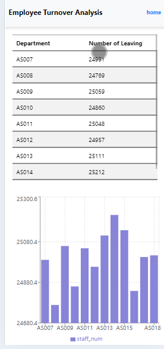
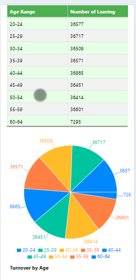
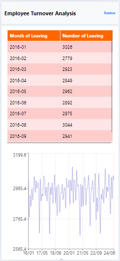

1.data preparation:

go to back_end root directory, create .env file follow .env_example, using your own postgresql database info: host= user= password= database=

execute the postgresql_script.sql to create table

pip install pandas faker using "generate fake data.py" to generate fake data to a csv file
you can either generate 300000 records then duplicate it using python pandas, then use copy command copy into database
or you can generate 300000 and import into database, and then use Cartesian product sql to duplicate in postgresql(postgresql_script.sql) for saving execution time in large volume dataset generation and import

import the dummy data to the table

go to the back_end folder, npm i all the dependencies, node ./api/server.js initiate the back_end server
go to front_end folder, npm i all the dependencies, npm start
home page:

Turnover by Department:

Turnover by Age:

Turnover by Month:

Pivot table:

